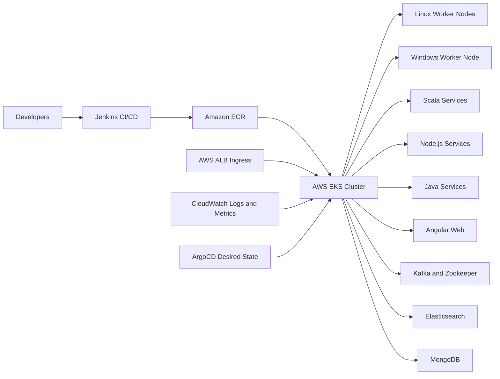
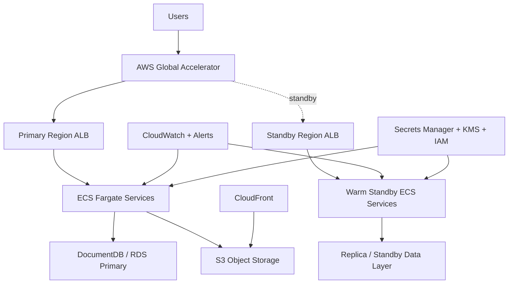
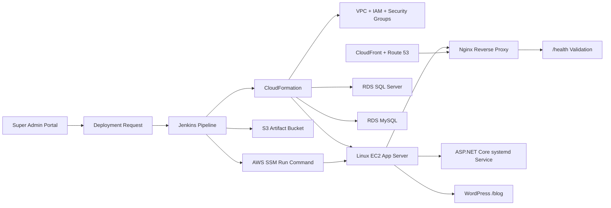
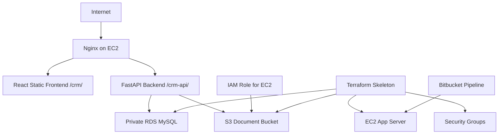
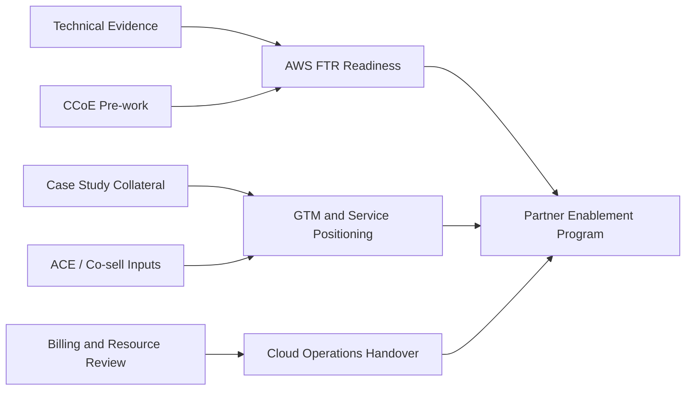

# Mermaid Diagrams Source

These diagrams are public-safe and can be reused in GitHub README files, portfolio pages, or converted to PNG/SVG later.

## Smart Building EKS Modernization

## IoT Healthcare ECS and DR

## Membership Deployment Automation

## Enterprise Automation AWS Deployment

## Cloud Partner Enablement Flow

