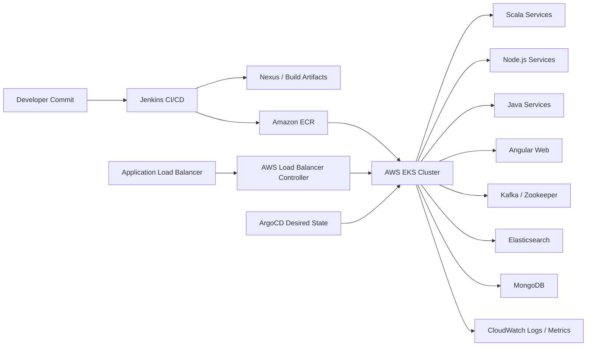
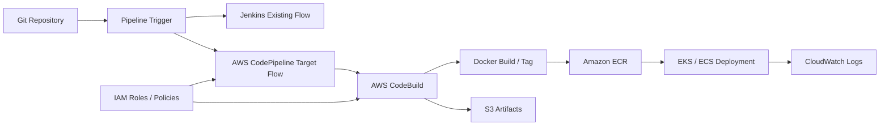
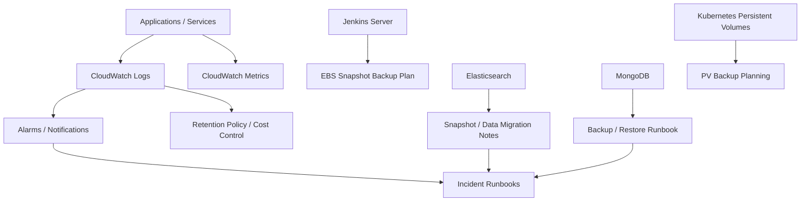
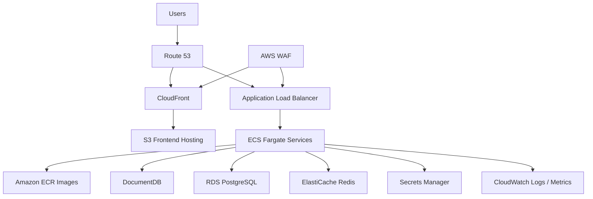
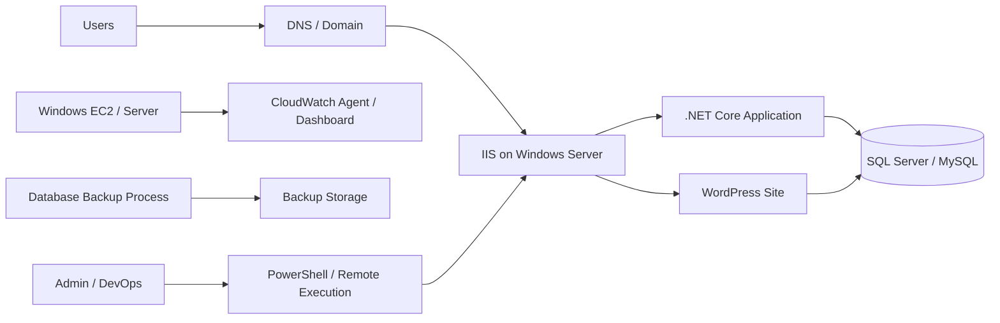
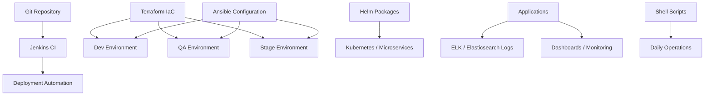
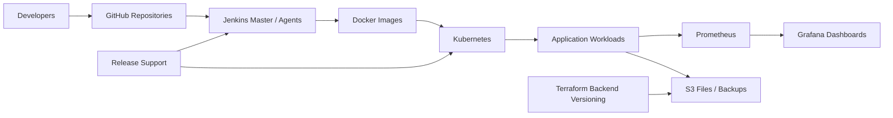

# Public-Safe DevOps Case Studies With Architecture Diagrams

Prepared for: **Saurabh Dindokar**  
Role: **AWS DevOps Engineer**  
Usage: **Naukri work sample, GitHub portfolio, LinkedIn featured/project content**

## Confidentiality Note

These case studies are written for public career use. Real client names, organization names, private repository names, production URLs, IP addresses, credentials, account identifiers, internal screenshots, and confidential architecture exports are intentionally excluded.

## Case Study 1: Smart Building Management Platform - On-Prem To AWS EKS Migration

### Project Overview

This project involved a full migration from a self-managed deployment model to AWS EKS for a large multi-service smart building management platform. The platform included backend services, frontend applications, messaging components, search/data services, and integration-heavy workloads.

The main engineering focus was to make the platform ready for Kubernetes operations with better deployment structure, container image flow, ALB ingress routing, pod-level health checks, monitoring visibility, and support-ready documentation.

### Architecture Diagram

### Problem

- Kubernetes workloads needed stronger production readiness.
- Multiple stacks needed consistent health-check behavior.
- Deployments required safer traffic routing and rollout validation.
- Teams needed clearer runbooks for troubleshooting and handover.

### My Work

- Supported AWS VPC, subnet, IAM, EKS, ECR, ALB ingress, and Kubernetes planning.
- Worked on Kubernetes manifests for Deployments, Services, ingress routing, probes, and storage concepts.
- Added and documented service health checks across Scala, Node.js, Angular, and Java services.
- Configured liveness and readiness probes so Kubernetes could restart unhealthy pods and avoid routing traffic to unready pods.
- Documented Jenkins/Nexus image flow, ECR publishing, ArgoCD deployment flow, CloudWatch monitoring, and troubleshooting steps.

### Result

- Improved pod-level stability through liveness/readiness probes.
- Reduced deployment risk by making readiness checks part of rollout behavior.
- Improved operational visibility through CloudWatch and structured handover notes.
- Created a reusable Kubernetes onboarding pattern for future services.

### Technologies

AWS EKS, Amazon ECR, ALB, AWS Load Balancer Controller, IAM, VPC, CloudWatch, Kubernetes, Docker, Jenkins, Nexus, ArgoCD, Kafka, Elasticsearch, MongoDB, Scala, Node.js, Angular, Java.

## Case Study 2: Smart Building Management Platform - Jenkins To AWS CI/CD Modernization

### Project Overview

This project focused on documenting and improving the migration path from Jenkins-heavy workflows toward AWS-native CI/CD services. The work covered source integration, build automation, Docker image creation, ECR publishing, S3 artifact handling, IAM permissions, CloudWatch logs, and deployment handover.

### CI/CD Flow Diagram

### Problem

- Build and release workflows depended on Jenkins knowledge and manual coordination.
- Docker image tagging, artifact handling, and release visibility needed clearer structure.
- AWS-native CI/CD migration required documented service permissions and operational steps.

### My Work

- Documented existing Jenkins pipeline behavior and release flow.
- Planned CodePipeline and CodeBuild structure for build and deployment automation.
- Documented Docker image build, tagging, ECR push, S3 artifact storage, IAM roles, and CloudWatch logging.
- Prepared support/handover documentation so future releases could be reviewed and troubleshot consistently.

### Result

- Created a clear migration path from Jenkins-driven releases to AWS-native CI/CD.
- Improved visibility around build logs, image publishing, and artifact handling.
- Reduced dependency on undocumented release knowledge.

### Technologies

Jenkins, AWS CodePipeline, AWS CodeBuild, Docker, Amazon ECR, Amazon S3, IAM, CloudWatch, Bitbucket/Git, Kubernetes, CI/CD.

## Case Study 3: Smart Building Management Platform - Monitoring, Backup And Cost Optimization

### Project Overview

This work improved operational readiness for monitoring, alerting, backup planning, recovery documentation, Elasticsearch data handling, MongoDB backup/restore, Jenkins backup planning, and CloudWatch log cost control.

### Operations Diagram

### Problem

- Monitoring, backup, and recovery processes needed stronger documentation.
- Log retention and backup storage needed cost-aware planning.
- Support teams needed repeatable runbooks.

### My Work

- Documented CloudWatch logging, monitoring, alerting, and notification practices.
- Prepared Jenkins backup planning using EBS snapshot concepts.
- Documented persistent volume backup concepts, Elasticsearch backup/data migration, and MongoDB backup/restore steps.
- Added CloudWatch log retention and cost optimization guidance.

### Result

- Improved operational readiness and backup/recovery clarity.
- Created repeatable runbooks for recurring support activities.
- Reduced risk from undocumented backup and monitoring processes.

### Technologies

AWS CloudWatch, AWS Lambda concepts, EBS Snapshots, EC2, S3, Jenkins, Elasticsearch, MongoDB, Kubernetes PVs, monitoring, alerting, backup automation, cost optimization.

## Case Study 4: IoT Healthcare Platform - AWS ECS/Fargate Migration And Cloud Operations

### Project Overview

This project involved AWS migration planning and cloud operations design for a platform with frontend applications, backend APIs, database services, storage, networking, security, monitoring, and disaster recovery requirements.

The target architecture used managed AWS services such as ECS/Fargate, ECR, ALB, S3, CloudFront, Route 53, WAF, Secrets Manager, CloudWatch, DocumentDB, RDS PostgreSQL, and ElastiCache Redis.

### Architecture Diagram

### Problem

- The platform needed a structured AWS migration path.
- Security, networking, database migration, monitoring, and DR needed clear planning.
- Production support required complete handover documentation.

### My Work

- Planned ECS/Fargate migration for backend APIs and supporting services.
- Covered multi-account AWS governance concepts, IAM Identity Center, roles, policies, VPC design, public/private subnets, ALB, ECR, S3, CloudFront, Route 53, WAF, and Secrets Manager.
- Supported migration planning for DocumentDB, RDS PostgreSQL, ElastiCache Redis, S3 object storage, signed URL flows, and environment configuration.
- Prepared CI/CD and production handover documentation covering image publishing, ECS deployment, environment variables, secrets, monitoring, alerting, DR/failover, and decommission planning.

### Result

- Produced a structured AWS migration and operations plan.
- Improved clarity for cloud service ownership, security controls, monitoring, DR, and production handover.

### Technologies

AWS Organizations, Control Tower concepts, IAM Identity Center, VPC, ECS Fargate, ECR, ALB, S3, CloudFront, Route 53, WAF, CloudWatch, DocumentDB, RDS PostgreSQL, ElastiCache Redis, Secrets Manager, GitHub Actions.

## Case Study 5: Fitness And Wellness Application - Windows Server, IIS And Cloud Monitoring

### Project Overview

This project focused on deployment planning and documentation for a Windows-based application stack using IIS, .NET hosting, WordPress hosting, database backup planning, CloudWatch dashboard setup, data transfer estimation, and cloud deployment proposal documentation.

### Deployment Diagram

### Problem

- The project needed a clear hosting and deployment approach for a Windows/IIS-based application.
- Monitoring, backup process, and deployment documentation needed to be understandable for operations.

### My Work

- Documented Windows server setup, IIS website setup, application pool configuration, .NET Core hosting, and WordPress hosting on the same domain.
- Prepared CloudWatch dashboard setup documentation for Windows server monitoring.
- Documented database backup process and AWS data transfer estimation.
- Supported reusable deployment planning using S3 artifact concepts, SSM/remote execution concepts, PowerShell, IIS, .NET, SQL Server/MySQL, PHP, and WordPress.

### Result

- Created a clearer deployment and operations plan for Windows server hosting.
- Improved documentation for IIS setup, app hosting, monitoring, backup, and production deployment.

### Technologies

AWS EC2, Windows Server, IIS, CloudWatch, S3, SSM concepts, PowerShell, .NET Core, WordPress, SQL Server/MySQL, PHP.

## Case Study 6: Enterprise Automation Platform - Infrastructure As Code, Jenkins And Monitoring

### Project Overview

This project covered infrastructure provisioning, CI administration, configuration management, deployment support, monitoring, logging, microservice packaging, and shell automation across non-production environments.

### IaC And Operations Diagram

### Problem

- Infrastructure provisioning needed repeatability across environments.
- CI/CD and configuration management needed better automation.
- Logs, dashboards, and day-to-day operational tasks needed stronger visibility.

### My Work

- Automated infrastructure provisioning for Dev, QA, and Stage environments using Terraform.
- Used Ansible for configuration management, application configuration, package management, and operational commands.
- Installed, configured, and administered Jenkins CI on Linux machines.
- Created dashboards and management reports using ELK/Elasticsearch.
- Developed Helm packages for microservice deployment and log management.
- Automated recurring operational tasks with shell scripts.

### Result

- Improved infrastructure repeatability, CI execution, configuration management, microservice deployment, and monitoring visibility across non-production environments.

### Technologies

Terraform, Ansible, Jenkins, Linux, AWS, Git, GitHub, Helm, Kubernetes, ELK/Elasticsearch, Shell scripting, CI/CD.

## Case Study 7: Digital Media Platform - Kubernetes, AWS S3, Jenkins And Application Monitoring

### Project Overview

This project involved production support and DevOps activities around application availability, monitoring, AWS S3 backups, Terraform backend versioning, Jenkins performance, GitHub repository maintenance, and Kubernetes-based container orchestration.

### Support And Delivery Diagram

### Problem

- The application needed reliable monitoring, release support, backup storage, repository maintenance, and improved Jenkins/Kubernetes operations.

### My Work

- Supported application availability and performance improvement activities.
- Monitored build machines, deployment machines, and application environments using Prometheus and Grafana.
- Created S3 buckets for files and backups.
- Used Terraform backend versioning concepts.
- Supported continuous delivery for releases.
- Implemented Jenkins master-agent structure to improve Jenkins performance.
- Maintained GitHub repositories and supported Kubernetes orchestration for Docker containers.

### Result

- Improved support readiness through monitoring, S3-based backup storage, Jenkins performance improvements, GitHub repository maintenance, and Kubernetes-based deployment support.

### Technologies

AWS S3, Terraform, Jenkins, GitHub, Kubernetes, Docker, Prometheus, Grafana, CI/CD, release support.
