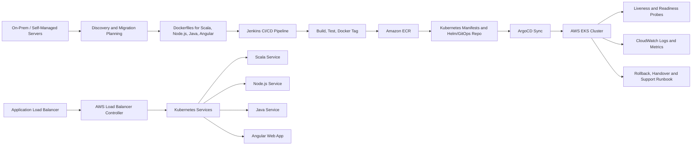

# POC 01: Smart Building Management Platform - On-Prem to AWS EKS Migration

Prepared for: **Saurabh Dindokar**  
Role: **AWS DevOps Engineer**  
Public-safe project name: **Smart Building Management Platform**  
## Confidentiality Note

This document is intentionally public-safe. It does not include real client names, internal project names, organization-owned source code, private URLs, IP addresses, credentials, account IDs, screenshots, or any confidential implementation details.

## Work Sample Summary

Public-safe DevOps work sample showing a full migration from on-prem/self-managed deployment to AWS EKS. The scope covers AWS foundation planning, Dockerization, image registry flow, Jenkins CI/CD, ArgoCD GitOps deployment, ALB ingress, Kubernetes manifests, health checks, monitoring, backup planning, rollout validation, and support handover.

## Problem Statement

- The application stack had to move from an on-prem/self-managed deployment model to a cloud-native AWS EKS platform.
- Multiple services, including Scala, Node.js, Java, and Angular components, needed containerization and Kubernetes deployment standards from scratch.
- The migration required CI/CD automation, GitOps deployment control, ALB ingress routing, ECR image management, health checks, monitoring, rollback planning, and production handover documentation.

## Mermaid Architecture Diagram

## My Responsibilities

- Worked on end-to-end migration planning from on-prem/self-managed hosting to AWS EKS.
- Created and documented Dockerfile patterns for Scala, Node.js, Java, and Angular services.
- Built CI/CD flow using Jenkins for source checkout, build, Docker image creation, tagging, and ECR push.
- Prepared Kubernetes deployment, service, ingress, ConfigMap/Secret reference, liveness probe, and readiness probe patterns.
- Configured ArgoCD/GitOps-oriented deployment flow so Kubernetes desired state can be reviewed and synced from repository changes.
- Documented ALB ingress routing, CloudWatch log visibility, rollout validation, rollback strategy, and production handover.

## Implementation Approach

- AWS EKS was treated as the target runtime for containerized application workloads with ALB-based public routing.
- Each service was containerized with environment-specific configuration separated from the image build.
- Jenkins handled build automation and image publishing, while ArgoCD handled Kubernetes deployment synchronization.
- Application health endpoints and static health files were added or documented across Scala, Node.js, Java, and Angular components.
- Kubernetes probes were standardized so pods become ready only when the application is able to serve traffic.
- CloudWatch logging and Kubernetes event checks were included in the migration validation runbook.

## Reliability, Security and Operations Focus

- Health checks, validation steps, and rollback planning were treated as part of deployment quality, not afterthoughts.
- Secrets, access boundaries, private networking, backup retention, and monitoring visibility were documented wherever applicable.
- The POC is written so another engineer can understand the flow, reproduce the approach, and extend it safely without exposing confidential data.

## Validation Checklist

1. Review architecture and confirm each component has a clear responsibility.
2. Validate deployment or automation steps in a non-production environment first.
3. Confirm logs, health checks, backup behavior, and rollback steps are documented.
4. Confirm access, secrets, and network boundaries follow least-privilege expectations.
5. Capture final runbook notes for handover and support readiness.

## Expected Outcomes

- Clear migration blueprint from on-prem/self-managed deployment to AWS EKS.
- Containerized multi-service release flow with Docker, Jenkins, ECR, Kubernetes, and ArgoCD.
- Improved deployment repeatability and reduced manual release dependency.
- Safer traffic handling through ALB ingress, readiness probes, and liveness probes.
- Better production support through CloudWatch visibility and documented rollback/handover steps.

## Technologies Used

AWS EKS, Kubernetes, Docker, Amazon ECR, ALB, AWS Load Balancer Controller, Jenkins, ArgoCD, CloudWatch, Scala, Node.js, Java, Angular

## Naukri Work Sample Description

Public-safe DevOps POC by Saurabh Dindokar covering architecture, responsibilities, implementation approach, validation checklist, operational focus, and measurable delivery outcomes. The document uses generic project naming and does not disclose any confidential client or organization information.

