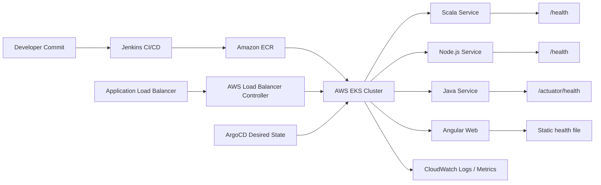

# POC 01: Smart Building Management Platform - EKS Stabilization

Prepared for: **Saurabh Dindokar**  
Role: **AWS DevOps Engineer**  
Public-safe name: **Smart Building Management Platform**

## Confidentiality Note

This POC is public-safe. It does not include real client names, internal repository names, production URLs, IP addresses, credentials, private screenshots, or organization-owned source code.

## POC Objective

Create a reusable Kubernetes/EKS stabilization blueprint for a multi-service platform with standardized health checks, liveness probes, readiness probes, ingress routing, CloudWatch logging, and deployment handover documentation.

## Architecture Diagram



## What I Worked On

- Supported AWS EKS migration and Kubernetes workload stabilization planning.
- Added and documented service health-check endpoints/files across Scala, Node.js, Angular, and Java services.
- Configured Kubernetes liveness and readiness probe patterns for pod-level stability.
- Documented ECR image flow, ALB ingress routing, CloudWatch visibility, and operational handover steps.

## POC Implementation Scope

- Dummy services for Scala, Node.js, Java, and Angular health-check behavior.
- Kubernetes manifests for Deployment, Service, Ingress, ConfigMap, and probe configuration.
- ALB ingress example using path-based routing.
- CloudWatch logging and troubleshooting notes.
- Rollout validation and rollback checklist.

## Suggested Repository Structure

```text
eks-health-stabilization-poc/
|-- README.md
|-- k8s/
|   |-- namespace.yaml
|   |-- scala-service.yaml
|   |-- node-service.yaml
|   |-- java-service.yaml
|   |-- angular-web.yaml
|   `-- ingress.yaml
|-- docs/
|   |-- runbook.md
|   |-- rollback.md
|   `-- troubleshooting.md
`-- diagrams/
    `-- architecture.mmd
```

## Validation Steps

1. Deploy dummy workloads to a local Kubernetes cluster or test EKS namespace.
2. Confirm all pods become ready only after readiness checks pass.
3. Simulate a failed health endpoint and confirm liveness restart behavior.
4. Confirm ingress routes traffic only to ready pods.
5. Review logs and events for troubleshooting documentation.

## Expected Outcome

- Safer Kubernetes rollouts.
- Better pod restart and readiness behavior.
- Clear health-check standard for future services.
- Better handover documentation for support teams.

## Technologies

AWS EKS, Kubernetes, Docker, Amazon ECR, ALB Ingress, AWS Load Balancer Controller, Jenkins, ArgoCD, CloudWatch, Scala, Node.js, Angular, Java.

