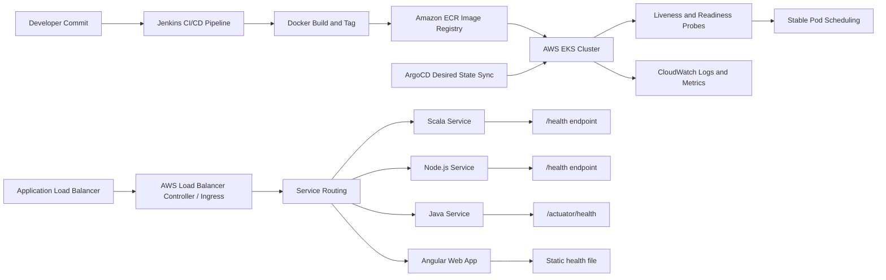

# POC 01: Smart Building Management Platform - EKS Stabilization

Prepared for: **Saurabh Dindokar**  
Role: **AWS DevOps Engineer**  
Public-safe project name: **Smart Building Management Platform**  
Document type: **Naukri-ready work sample / portfolio POC**

## Confidentiality Note

This document is intentionally public-safe. It does not include real client names, internal project names, organization-owned source code, private URLs, IP addresses, credentials, account IDs, screenshots, or any confidential implementation details.

## Work Sample Summary

Public-safe DevOps work sample showing Kubernetes/EKS stabilization for a multi-service platform with standardized health checks, rollout safety, ALB ingress, image flow, and production support documentation.

## Problem Statement

- Multiple services were deployed with different health-check behavior, which made pod readiness and failure detection inconsistent.
- The platform required better pod-level visibility across backend and frontend services before production handover.
- Deployment documentation needed to clearly explain validation, rollback, and troubleshooting steps for support teams.

## Mermaid Architecture Diagram

## My Responsibilities

- Prepared Kubernetes health-check standards for Scala, Node.js, Java, and Angular workloads.
- Documented liveness and readiness probe behavior to reduce unsafe traffic routing during startup or unhealthy states.
- Mapped image build, ECR push, Kubernetes deployment, ingress routing, logging, and validation flow.
- Created operational notes for rollout verification, failure checks, and rollback readiness.

## Implementation Approach

- Deployment templates include resource requests/limits, readiness probes, liveness probes, service definitions, and ingress routing.
- Application health checks are separated from traffic readiness so a pod becomes live and ready only after required checks pass.
- CloudWatch visibility is included for pod logs, deployment troubleshooting, and basic production diagnostics.
- Runbook sections explain what to check before rollout, after rollout, and during rollback.

## Reliability, Security and Operations Focus

- Health checks, validation steps, and rollback planning were treated as part of deployment quality, not afterthoughts.
- Secrets, access boundaries, private networking, backup retention, and monitoring visibility were documented wherever applicable.
- The POC is written so another engineer can understand the flow, reproduce the approach, and extend it safely without exposing confidential data.

## Validation Checklist

1. Review architecture and confirm each component has a clear responsibility.
2. Validate deployment or automation steps in a non-production environment first.
3. Confirm logs, health checks, backup behavior, and rollback steps are documented.
4. Confirm access, secrets, and network boundaries follow least-privilege expectations.
5. Capture final runbook notes for handover and support readiness.

## Expected Outcomes

- More predictable Kubernetes rollout behavior.
- Reduced chance of routing production traffic to unready pods.
- Reusable health-check approach for future services.
- Cleaner handover documentation for operations and support.

## Technologies Used

AWS EKS, Kubernetes, Docker, Amazon ECR, ALB, AWS Load Balancer Controller, Jenkins, ArgoCD, CloudWatch, Scala, Node.js, Java, Angular

## Naukri Work Sample Description

Public-safe DevOps POC by Saurabh Dindokar covering architecture, responsibilities, implementation approach, validation checklist, operational focus, and measurable delivery outcomes. The document uses generic project naming and does not disclose any confidential client or organization information.

