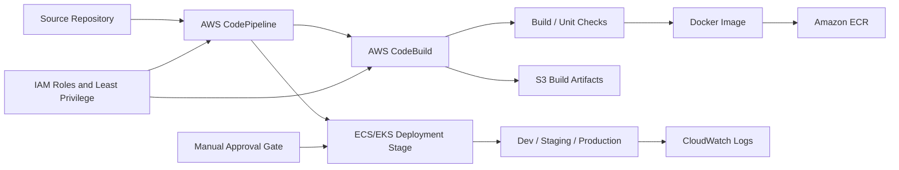

# POC 02: Smart Building Management Platform - CI/CD Modernization

Prepared for: **Saurabh Dindokar**  
Role: **AWS DevOps Engineer**  
Public-safe project name: **Smart Building Management Platform**  
Document type: **Naukri-ready work sample / portfolio POC**

## Confidentiality Note

This document is intentionally public-safe. It does not include real client names, internal project names, organization-owned source code, private URLs, IP addresses, credentials, account IDs, screenshots, or any confidential implementation details.

## Work Sample Summary

Public-safe work sample for moving release flow from a traditional Jenkins-heavy pattern toward AWS-native CI/CD using CodePipeline, CodeBuild, ECR, S3 artifacts, IAM, and CloudWatch logs.

## Problem Statement

- The release workflow required a cleaner build, artifact, image, and deployment chain.
- Manual dependency on one CI/CD path increased operational risk during repeated deployments.
- The team needed documented plan-only migration steps that could be reviewed before production implementation.

## Mermaid Architecture Diagram

## My Responsibilities

- Mapped existing Jenkins release stages into AWS-native pipeline stages.
- Prepared pipeline flow for source, build, Docker image publishing, artifact storage, approval, and deployment.
- Documented IAM role boundaries for pipeline, build, ECR, S3, and CloudWatch access.
- Defined rollback and artifact traceability notes for safer releases.

## Implementation Approach

- Pipeline stages separate source fetch, build validation, image creation, image push, and deployment.
- Build logs and failure traces are routed to CloudWatch for easy troubleshooting.
- Environment-specific deployment stages can use approval gates for production control.
- Artifacts and image tags are traceable so a previous version can be redeployed when needed.

## Reliability, Security and Operations Focus

- Health checks, validation steps, and rollback planning were treated as part of deployment quality, not afterthoughts.
- Secrets, access boundaries, private networking, backup retention, and monitoring visibility were documented wherever applicable.
- The POC is written so another engineer can understand the flow, reproduce the approach, and extend it safely without exposing confidential data.

## Validation Checklist

1. Review architecture and confirm each component has a clear responsibility.
2. Validate deployment or automation steps in a non-production environment first.
3. Confirm logs, health checks, backup behavior, and rollback steps are documented.
4. Confirm access, secrets, and network boundaries follow least-privilege expectations.
5. Capture final runbook notes for handover and support readiness.

## Expected Outcomes

- Improved release traceability.
- Cleaner AWS-native build and deployment workflow.
- Reduced manual deployment dependency.
- Better CI/CD documentation for future onboarding.

## Technologies Used

AWS CodePipeline, AWS CodeBuild, Jenkins, Docker, Amazon ECR, S3, IAM, CloudWatch, ECS/EKS

## Naukri Work Sample Description

Public-safe DevOps POC by Saurabh Dindokar covering architecture, responsibilities, implementation approach, validation checklist, operational focus, and measurable delivery outcomes. The document uses generic project naming and does not disclose any confidential client or organization information.

