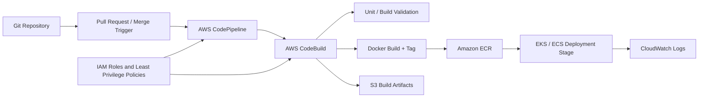

# POC 02: Smart Building Management Platform - CI/CD Modernization

Prepared for: **Saurabh Dindokar**  
Role: **AWS DevOps Engineer**  
Public-safe name: **Smart Building Management Platform**

## Confidentiality Note

This POC is public-safe and uses generic source, build, and deployment names. No private pipeline values, repository names, credentials, or client identifiers are included.

## POC Objective

Design a migration pattern from Jenkins-heavy build workflows toward AWS-native CI/CD using CodePipeline, CodeBuild, Docker image builds, Amazon ECR, S3 artifact storage, IAM roles, CloudWatch logs, and deployment handover notes.

## CI/CD Architecture Diagram



## What I Worked On

- Documented existing Jenkins release flow and migration considerations.
- Planned CodePipeline and CodeBuild build stages.
- Documented Docker image build, tagging, ECR push, S3 artifact handling, IAM permissions, and CloudWatch logging.
- Prepared handover notes for release support and troubleshooting.

## POC Implementation Scope

- Dummy app repository with Dockerfile.
- Buildspec file for CodeBuild.
- CodePipeline stages for source, build, and deployment placeholder.
- ECR image naming and tagging standard.
- CloudWatch log group and retention notes.
- IAM least-privilege checklist.

## Suggested Repository Structure

```text
aws-cicd-modernization-poc/
|-- README.md
|-- app/
|   |-- Dockerfile
|   `-- health.html
|-- buildspec.yml
|-- terraform/
|   |-- codebuild.tf
|   |-- codepipeline.tf
|   |-- ecr.tf
|   |-- iam.tf
|   `-- s3.tf
`-- docs/
    |-- release-runbook.md
    `-- troubleshooting.md
```

## Validation Steps

1. Run Docker build locally for the dummy app.
2. Validate `buildspec.yml` commands.
3. Run Terraform `fmt`, `validate`, and plan-only review.
4. Confirm pipeline stages and IAM responsibilities are documented.
5. Confirm CloudWatch log and artifact retention notes are present.

## Expected Outcome

- Clear Jenkins-to-AWS CI/CD migration blueprint.
- Repeatable image build and ECR publishing pattern.
- Better release visibility through CloudWatch logs and documented handover.

## Technologies

Jenkins, AWS CodePipeline, AWS CodeBuild, Docker, Amazon ECR, Amazon S3, IAM, CloudWatch, Terraform, Kubernetes/ECS deployment concepts.

