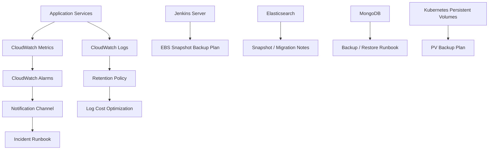

# POC 03: Smart Building Management Platform - Monitoring, Backup And Cost Optimization

Prepared for: **Saurabh Dindokar**  
Role: **AWS DevOps Engineer**  
Public-safe name: **Smart Building Management Platform**

## Confidentiality Note

This POC excludes private backup paths, repository names, environment values, credentials, internal dashboards, and production identifiers.

## POC Objective

Build an operations blueprint for monitoring, alerting, backup planning, recovery documentation, Elasticsearch data handling, MongoDB backup/restore, Jenkins backup planning, and CloudWatch log cost control.

## Operations Architecture Diagram



## What I Worked On

- Documented CloudWatch logging, monitoring, alerts, and notification practices.
- Prepared Jenkins backup planning using EBS snapshot concepts.
- Documented Elasticsearch backup/data migration and MongoDB backup/restore approach.
- Added log retention and cost optimization guidance.

## POC Implementation Scope

- CloudWatch log retention example.
- Alarm design for service errors, high CPU/memory, and failed jobs.
- Backup runbooks for Jenkins, MongoDB, Elasticsearch, and persistent storage.
- Recovery verification checklist.
- Cost-control checklist for logs and backups.

## Suggested Repository Structure

```text
monitoring-backup-cost-poc/
|-- README.md
|-- cloudwatch/
|   |-- alarms.md
|   `-- log-retention.md
|-- backup/
|   |-- jenkins-backup.md
|   |-- mongodb-backup-restore.md
|   |-- elasticsearch-snapshot.md
|   `-- pv-backup.md
`-- runbooks/
    |-- incident-response.md
    `-- restore-verification.md
```

## Validation Steps

1. Review log retention and alarm thresholds.
2. Run backup commands against dummy/local services where possible.
3. Restore backup into a non-production target.
4. Confirm row/document counts or service health after restore.
5. Document restore outcome and improvement notes.

## Expected Outcome

- Stronger operational readiness.
- Repeatable backup and restore documentation.
- Better CloudWatch log cost control.
- Clearer monitoring and incident response handover.

## Technologies

AWS CloudWatch, EBS Snapshots, S3, EC2, Jenkins, Elasticsearch, MongoDB, Kubernetes Persistent Volumes, monitoring, alerting, backup automation, cost optimization.

