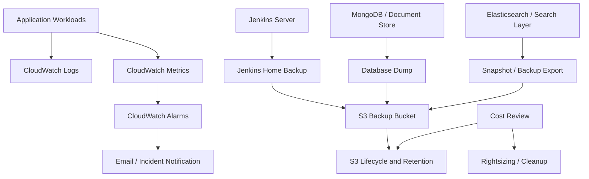

# POC 03: Smart Building Management Platform - Monitoring, Backup and Cost Optimization

Prepared for: **Saurabh Dindokar**  
Role: **AWS DevOps Engineer**  
Public-safe project name: **Smart Building Management Platform**  
## Confidentiality Note

This document is intentionally public-safe. It does not include real client names, internal project names, organization-owned source code, private URLs, IP addresses, credentials, account IDs, screenshots, or any confidential implementation details.

## Work Sample Summary

Public-safe work sample covering monitoring, alerting, backup automation, retention control, Jenkins backup, database backup, log visibility, and practical cost optimization checks.

## Problem Statement

- Operational teams needed better visibility into compute, deployment, backup, and application health.
- Backup activity required documented scripts, retention behavior, and restoration verification.
- Cloud resources needed periodic cost review for unused or oversized components.

## Mermaid Architecture Diagram

## My Responsibilities

- Prepared backup and retention approach for CI/CD server data and database components.
- Documented CloudWatch dashboards, alarms, log groups, and troubleshooting checkpoints.
- Created cost optimization checklist covering unused resources, storage lifecycle, right sizing, and backup retention.
- Defined restore verification steps so backup success is not assumed without validation.

## Implementation Approach

- Backup scripts create timestamped archives and store them in a controlled S3 path.
- Retention rules keep recent backups while reducing long-term storage cost.
- CloudWatch alarms are mapped to actionable failure conditions, not noisy generic metrics only.
- Cost review focuses on EC2/EBS snapshots, S3 lifecycle, idle resources, and oversized compute.

## Reliability, Security and Operations Focus

- Health checks, validation steps, and rollback planning were treated as part of deployment quality, not afterthoughts.
- Secrets, access boundaries, private networking, backup retention, and monitoring visibility were documented wherever applicable.
- The POC is written so another engineer can understand the flow, reproduce the approach, and extend it safely without exposing confidential data.

## Validation Checklist

1. Review architecture and confirm each component has a clear responsibility.
2. Validate deployment or automation steps in a non-production environment first.
3. Confirm logs, health checks, backup behavior, and rollback steps are documented.
4. Confirm access, secrets, and network boundaries follow least-privilege expectations.
5. Capture final runbook notes for handover and support readiness.

## Expected Outcomes

- Improved backup confidence through restore validation.
- Better operational visibility for incidents.
- Reduced avoidable cloud spend through retention and cleanup planning.
- Clear support runbook for monitoring and backup ownership.

## Technologies Used

CloudWatch, S3, Jenkins, Shell Scripting, Elasticsearch, MongoDB, AWS Cost Explorer, EC2, EBS, IAM

## Naukri Work Sample Description

Public-safe DevOps POC by Saurabh Dindokar covering architecture, responsibilities, implementation approach, validation checklist, operational focus, and measurable delivery outcomes. The document uses generic project naming and does not disclose any confidential client or organization information.

