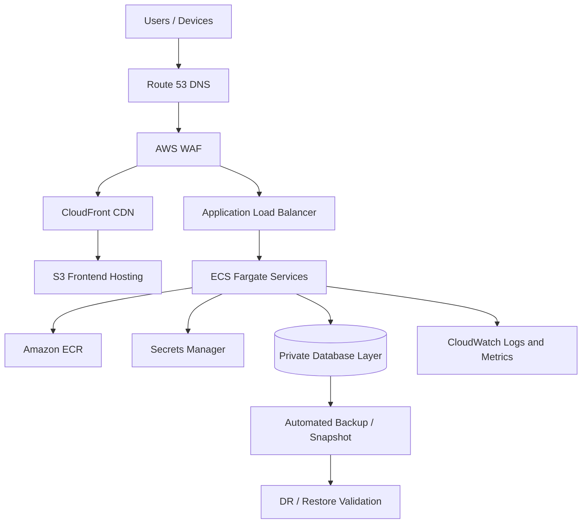

# POC 04: IoT Healthcare Platform - ECS/Fargate Migration

Prepared for: **Saurabh Dindokar**  
Role: **AWS DevOps Engineer**  
Public-safe project name: **IoT Healthcare Platform**  
Document type: **Naukri-ready work sample / portfolio POC**

## Confidentiality Note

This document is intentionally public-safe. It does not include real client names, internal project names, organization-owned source code, private URLs, IP addresses, credentials, account IDs, screenshots, or any confidential implementation details.

## Work Sample Summary

Public-safe work sample for AWS migration using ECS/Fargate, ALB, ECR, S3, CloudFront, Route 53, WAF, Secrets Manager, database services, backup planning, and DR-focused handover.

## Problem Statement

- The platform required a managed container hosting model with reduced server maintenance.
- Frontend and backend components needed a clean AWS delivery pattern with secure routing and secret handling.
- Migration documentation needed to cover deployment, monitoring, backup, rollback, and production handover.

## Mermaid Architecture Diagram

## My Responsibilities

- Planned containerized backend deployment using ECS/Fargate with private service networking.
- Mapped frontend delivery through S3 and CloudFront with DNS and WAF protection.
- Prepared ECR image flow, secrets handling, CloudWatch logging, and deployment validation notes.
- Documented backup, disaster recovery, and production handover checkpoints.

## Implementation Approach

- ECS tasks run in private subnets and receive traffic only through the application load balancer.
- Secrets are injected through managed secret storage instead of being kept in code or images.
- Frontend static assets are delivered through CDN while backend APIs are routed through ALB.
- DR planning includes backup schedule, restore verification, DNS considerations, and monitoring checks.

## Reliability, Security and Operations Focus

- Health checks, validation steps, and rollback planning were treated as part of deployment quality, not afterthoughts.
- Secrets, access boundaries, private networking, backup retention, and monitoring visibility were documented wherever applicable.
- The POC is written so another engineer can understand the flow, reproduce the approach, and extend it safely without exposing confidential data.

## Validation Checklist

1. Review architecture and confirm each component has a clear responsibility.
2. Validate deployment or automation steps in a non-production environment first.
3. Confirm logs, health checks, backup behavior, and rollback steps are documented.
4. Confirm access, secrets, and network boundaries follow least-privilege expectations.
5. Capture final runbook notes for handover and support readiness.

## Expected Outcomes

- Reduced infrastructure maintenance compared to manually managed servers.
- Improved security posture through private workloads and managed secrets.
- Better production support through clear logs, backups, and handover notes.
- Reusable AWS migration blueprint for containerized applications.

## Technologies Used

AWS ECS Fargate, ALB, ECR, S3, CloudFront, Route 53, WAF, Secrets Manager, CloudWatch, RDS/Database, Docker

## Naukri Work Sample Description

Public-safe DevOps POC by Saurabh Dindokar covering architecture, responsibilities, implementation approach, validation checklist, operational focus, and measurable delivery outcomes. The document uses generic project naming and does not disclose any confidential client or organization information.

