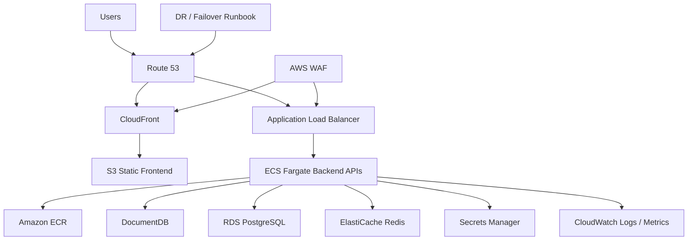

# POC 04: IoT Healthcare Platform - ECS/Fargate Migration And Cloud Operations

Prepared for: **Saurabh Dindokar**  
Role: **AWS DevOps Engineer**  
Public-safe name: **IoT Healthcare Platform**

## Confidentiality Note

This POC uses generic healthcare platform naming and excludes real domains, VPN details, IP addresses, credentials, private diagrams, and environment-specific values.

## POC Objective

Design a secure AWS ECS/Fargate migration pattern for frontend applications, backend APIs, database services, object storage, networking, security controls, monitoring, disaster recovery, and production handover.

## Architecture Diagram



## What I Worked On

- Planned ECS/Fargate migration for APIs and supporting services.
- Covered VPC, public/private subnets, ALB, ECR, S3, CloudFront, Route 53, WAF, Secrets Manager, IAM, and CloudWatch.
- Supported migration planning for DocumentDB, RDS PostgreSQL, ElastiCache Redis, S3 object storage, signed URL flows, and environment configuration.
- Prepared CI/CD, monitoring, alerting, DR/failover, and production handover documentation.

## POC Implementation Scope

- Terraform blueprint for VPC, ALB, ECS service, ECR, S3, CloudFront, and RDS placeholder.
- Dummy backend container deployed on ECS/Fargate.
- Frontend static hosting pattern using S3 and CloudFront.
- Secrets and environment variable handling notes.
- Monitoring, DR, and cutover runbooks.

## Suggested Repository Structure

```text
ecs-fargate-migration-poc/
|-- README.md
|-- terraform/
|   |-- network.tf
|   |-- ecs.tf
|   |-- alb.tf
|   |-- ecr.tf
|   |-- storage.tf
|   `-- monitoring.tf
|-- app/
|   `-- Dockerfile
`-- docs/
    |-- migration-plan.md
    |-- dr-runbook.md
    `-- production-handover.md
```

## Validation Steps

1. Run Terraform `fmt`, `validate`, and plan-only review.
2. Build dummy Docker image locally.
3. Review ECS task definition and service configuration.
4. Confirm RDS remains private and security groups are restrictive.
5. Review monitoring and failover runbooks.

## Expected Outcome

- Clear ECS/Fargate migration blueprint.
- Secure private database access pattern.
- Better service monitoring, cutover, DR, and handover documentation.

## Technologies

AWS ECS Fargate, ECR, ALB, VPC, S3, CloudFront, Route 53, WAF, CloudWatch, DocumentDB, RDS PostgreSQL, ElastiCache Redis, Secrets Manager, GitHub Actions, Terraform.

