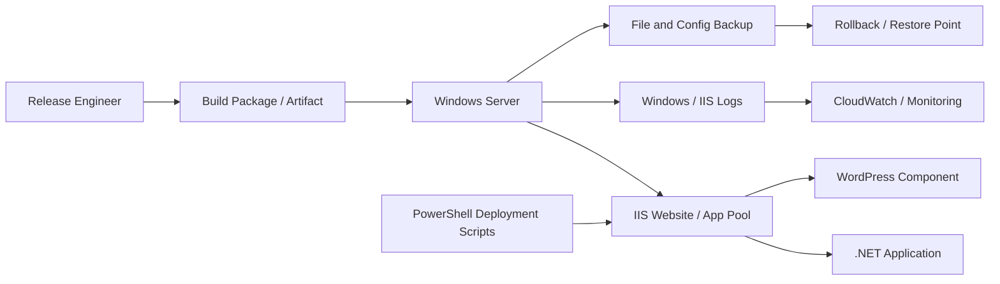

# POC 05: Fitness and Wellness Application - Windows IIS Deployment

Prepared for: **Saurabh Dindokar**  
Role: **AWS DevOps Engineer**  
Public-safe project name: **Fitness and Wellness Application**  
Document type: **Naukri-ready work sample / portfolio POC**

## Confidentiality Note

This document is intentionally public-safe. It does not include real client names, internal project names, organization-owned source code, private URLs, IP addresses, credentials, account IDs, screenshots, or any confidential implementation details.

## Work Sample Summary

Public-safe work sample for Windows Server deployment with IIS, .NET hosting, WordPress support, PowerShell automation, backups, monitoring, and production validation checklist.

## Problem Statement

- The application required stable deployment on Windows Server with IIS and supporting components.
- Deployment steps needed to be repeatable for releases, configuration updates, and rollback.
- Operational documentation was required for backup, logs, service checks, and post-deployment validation.

## Mermaid Architecture Diagram

## My Responsibilities

- Prepared IIS deployment steps for .NET application hosting and related web components.
- Documented application pool settings, site binding checks, service restart steps, and validation flow.
- Used PowerShell-oriented deployment and backup approach for repeatability.
- Created troubleshooting checklist for IIS logs, Windows services, permissions, and rollback.

## Implementation Approach

- Deployment flow includes pre-backup, artifact placement, app pool recycle, binding validation, and health checks.
- Configuration backup is taken before changes to support controlled rollback.
- Monitoring notes cover server health, application logs, and access/error log checks.
- Runbook helps support teams verify post-deployment behavior without depending on memory.

## Reliability, Security and Operations Focus

- Health checks, validation steps, and rollback planning were treated as part of deployment quality, not afterthoughts.
- Secrets, access boundaries, private networking, backup retention, and monitoring visibility were documented wherever applicable.
- The POC is written so another engineer can understand the flow, reproduce the approach, and extend it safely without exposing confidential data.

## Validation Checklist

1. Review architecture and confirm each component has a clear responsibility.
2. Validate deployment or automation steps in a non-production environment first.
3. Confirm logs, health checks, backup behavior, and rollback steps are documented.
4. Confirm access, secrets, and network boundaries follow least-privilege expectations.
5. Capture final runbook notes for handover and support readiness.

## Expected Outcomes

- More controlled Windows/IIS deployment process.
- Reduced rollback uncertainty through pre-change backups.
- Better application support through log and service validation.
- Clear deployment handover for repeated releases.

## Technologies Used

Windows Server, IIS, .NET, WordPress, PowerShell, CloudWatch/Monitoring, Backup and Restore, DNS, SSL/TLS

## Naukri Work Sample Description

Public-safe DevOps POC by Saurabh Dindokar covering architecture, responsibilities, implementation approach, validation checklist, operational focus, and measurable delivery outcomes. The document uses generic project naming and does not disclose any confidential client or organization information.

