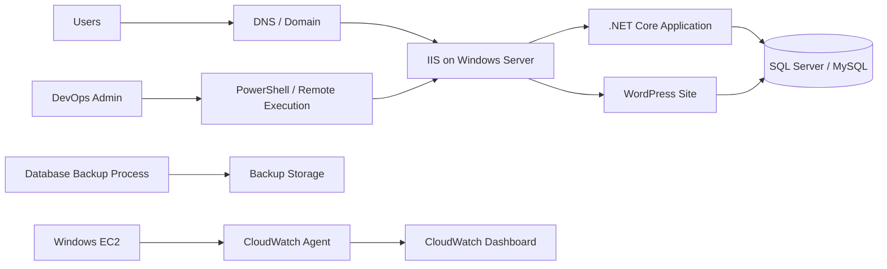

# POC 05: Fitness And Wellness Application - Windows IIS Deployment And Monitoring

Prepared for: **Saurabh Dindokar**  
Role: **AWS DevOps Engineer**  
Public-safe name: **Fitness And Wellness Application**

## Confidentiality Note

This POC excludes private domains, server IPs, database credentials, internal deployment values, and client-specific screenshots.

## POC Objective

Create a Windows/IIS deployment and monitoring blueprint for a mixed application stack with .NET hosting, WordPress hosting, database backup planning, CloudWatch dashboard setup, data transfer estimation, and production handover.

## Deployment Architecture Diagram



## What I Worked On

- Documented Windows server setup, IIS website setup, application pool configuration, .NET Core hosting, and WordPress hosting.
- Prepared CloudWatch dashboard setup documentation for Windows server monitoring.
- Documented database backup process and data transfer estimation.
- Supported reusable deployment planning using S3 artifact concepts, SSM/remote execution concepts, PowerShell, IIS, .NET, SQL Server/MySQL, PHP, and WordPress.

## POC Implementation Scope

- Windows IIS deployment checklist.
- PowerShell deployment commands for dummy artifact copy and IIS restart.
- CloudWatch Agent installation and dashboard notes.
- Database backup and restore checklist.
- Production validation and rollback runbook.

## Suggested Repository Structure

```text
windows-iis-deployment-poc/
|-- README.md
|-- powershell/
|   |-- deploy.ps1
|   |-- rollback.ps1
|   `-- health-check.ps1
|-- docs/
|   |-- iis-setup.md
|   |-- cloudwatch-monitoring.md
|   |-- database-backup.md
|   `-- production-checklist.md
`-- diagrams/
    `-- architecture.mmd
```

## Validation Steps

1. Validate IIS site and app pool setup steps.
2. Run PowerShell deployment script against a dummy folder structure.
3. Confirm service/site health after deployment.
4. Review CloudWatch Agent configuration.
5. Validate backup and rollback documentation.

## Expected Outcome

- Repeatable Windows/IIS deployment approach.
- Clear monitoring and backup documentation.
- Better production handover for Windows-hosted workloads.

## Technologies

AWS EC2, Windows Server, IIS, CloudWatch, S3, SSM concepts, PowerShell, .NET Core, WordPress, SQL Server/MySQL, PHP.

