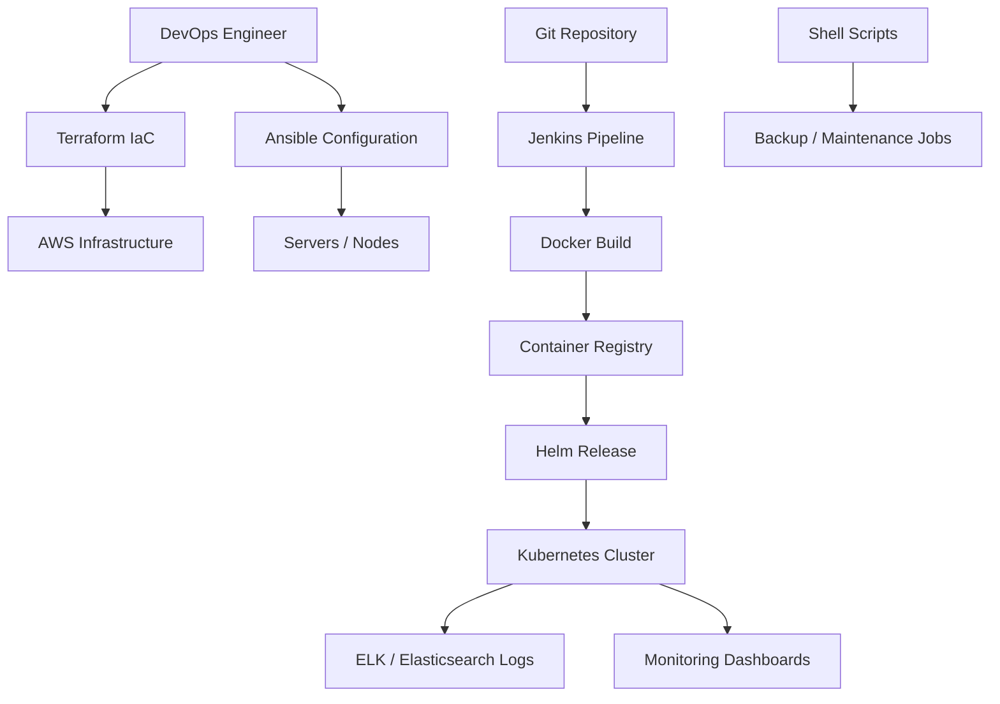

# POC 06: Enterprise Automation Platform - IaC and Monitoring

Prepared for: **Saurabh Dindokar**  
Role: **AWS DevOps Engineer**  
Public-safe project name: **Enterprise Automation Platform**  
Document type: **Naukri-ready work sample / portfolio POC**

## Confidentiality Note

This document is intentionally public-safe. It does not include real client names, internal project names, organization-owned source code, private URLs, IP addresses, credentials, account IDs, screenshots, or any confidential implementation details.

## Work Sample Summary

Public-safe work sample covering Terraform, Ansible, Jenkins, Helm, Kubernetes, ELK/Elasticsearch, shell scripting, infrastructure documentation, and monitoring runbooks.

## Problem Statement

- Infrastructure and deployment tasks needed better repeatability through scripts and IaC patterns.
- The team needed structured automation for provisioning, configuration, deployment, and monitoring support.
- Operational knowledge needed to be captured in reusable documentation and validation checklists.

## Mermaid Architecture Diagram

## My Responsibilities

- Prepared IaC and automation patterns for provisioning and repeatable environment setup.
- Worked on deployment automation using Jenkins, Docker, Helm, and Kubernetes workflows.
- Supported monitoring/logging visibility through ELK or Elasticsearch-oriented documentation.
- Created script-based operational tasks for backup, validation, and maintenance.

## Implementation Approach

- Terraform structure separates reusable modules and environment-level variables.
- Ansible handles configuration and repeatable server setup where required.
- Jenkins pipelines perform build, validation, packaging, and deployment trigger steps.
- Monitoring documentation explains log flow, dashboard use, incident checks, and escalation notes.

## Reliability, Security and Operations Focus

- Health checks, validation steps, and rollback planning were treated as part of deployment quality, not afterthoughts.
- Secrets, access boundaries, private networking, backup retention, and monitoring visibility were documented wherever applicable.
- The POC is written so another engineer can understand the flow, reproduce the approach, and extend it safely without exposing confidential data.

## Validation Checklist

1. Review architecture and confirm each component has a clear responsibility.
2. Validate deployment or automation steps in a non-production environment first.
3. Confirm logs, health checks, backup behavior, and rollback steps are documented.
4. Confirm access, secrets, and network boundaries follow least-privilege expectations.
5. Capture final runbook notes for handover and support readiness.

## Expected Outcomes

- Improved infrastructure repeatability.
- Reduced manual configuration drift.
- Cleaner CI/CD and deployment ownership.
- Better monitoring visibility and operational documentation.

## Technologies Used

Terraform, Ansible, Jenkins, Docker, Helm, Kubernetes, ELK, Elasticsearch, Shell Scripting, AWS, Git

## Naukri Work Sample Description

Public-safe DevOps POC by Saurabh Dindokar covering architecture, responsibilities, implementation approach, validation checklist, operational focus, and measurable delivery outcomes. The document uses generic project naming and does not disclose any confidential client or organization information.

