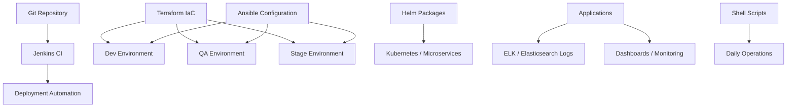

# POC 06: Enterprise Automation Platform - IaC, Jenkins And Monitoring

Prepared for: **Saurabh Dindokar**  
Role: **AWS DevOps Engineer**  
Public-safe name: **Enterprise Automation Platform**

## Confidentiality Note

This POC excludes internal environment values, repository URLs, server IPs, credentials, dashboard links, and client-specific implementation details.

## POC Objective

Create a repeatable infrastructure and operations blueprint using Terraform, Ansible, Jenkins, Helm, Kubernetes, ELK/Elasticsearch, dashboards, and shell scripting for Dev, QA, and Stage environments.

## IaC And Operations Diagram



## What I Worked On

- Automated infrastructure provisioning for Dev, QA, and Stage environments using Terraform.
- Used Ansible for configuration management, application configuration, package management, and operational commands.
- Installed, configured, and administered Jenkins CI on Linux machines.
- Created dashboards and management reports using ELK/Elasticsearch.
- Developed Helm packages for microservice deployment and log management.
- Automated recurring operational tasks with shell scripts.

## POC Implementation Scope

- Terraform module skeleton for repeated environments.
- Ansible playbooks for package/configuration setup.
- Jenkins pipeline for build and deployment.
- Helm chart structure for dummy microservice.
- ELK/Grafana monitoring documentation.
- Shell scripts for operational automation.

## Suggested Repository Structure

```text
iac-jenkins-monitoring-poc/
|-- README.md
|-- terraform/
|   |-- modules/
|   `-- envs/
|-- ansible/
|   |-- inventory.ini
|   `-- playbook.yml
|-- helm/
|   `-- dummy-service/
|-- jenkins/
|   `-- Jenkinsfile
|-- scripts/
|   `-- daily-checks.sh
`-- docs/
    |-- monitoring.md
    `-- runbook.md
```

## Validation Steps

1. Run Terraform `fmt` and `validate`.
2. Run Ansible syntax check.
3. Review Jenkins pipeline stages.
4. Render Helm templates.
5. Run shell script lint/checks where available.

## Expected Outcome

- Repeatable non-production infrastructure pattern.
- Better CI/CD and configuration management.
- Improved logging, dashboards, and operational automation.

## Technologies

Terraform, Ansible, Jenkins, Linux, AWS, Git, GitHub, Helm, Kubernetes, ELK/Elasticsearch, Grafana, Shell scripting, CI/CD.

