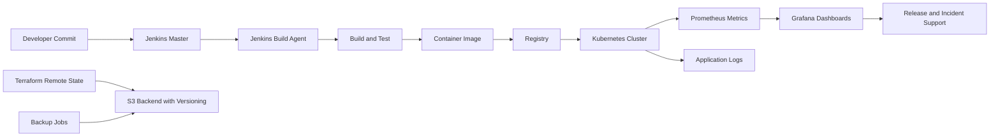

# POC 07: Digital Media Platform - Kubernetes Monitoring and Release Support

Prepared for: **Saurabh Dindokar**  
Role: **AWS DevOps Engineer**  
Public-safe project name: **Digital Media Platform**  
Document type: **Naukri-ready work sample / portfolio POC**

## Confidentiality Note

This document is intentionally public-safe. It does not include real client names, internal project names, organization-owned source code, private URLs, IP addresses, credentials, account IDs, screenshots, or any confidential implementation details.

## Work Sample Summary

Public-safe work sample for Kubernetes operations, Jenkins master-agent build pattern, S3 backup strategy, Terraform backend versioning, Prometheus, Grafana, and release support.

## Problem Statement

- The platform required stronger visibility into Kubernetes workloads and release behavior.
- CI/CD worker execution needed a scalable master-agent style pattern.
- Backup and Terraform state practices needed documentation to support safe operations.

## Mermaid Architecture Diagram

## My Responsibilities

- Supported Kubernetes deployment and monitoring practices for application release workflows.
- Documented Jenkins master-agent pipeline model for build execution and separation of workloads.
- Prepared monitoring flow using Prometheus and Grafana for workload visibility.
- Captured Terraform state, S3 backup, and release support practices in public-safe form.

## Implementation Approach

- Jenkins agents execute build steps while the master coordinates pipeline flow.
- Kubernetes workloads are observed through metrics, logs, dashboards, and deployment events.
- Terraform state is stored remotely with versioning and access controls.
- Backup jobs and release notes support incident response and recovery confidence.

## Reliability, Security and Operations Focus

- Health checks, validation steps, and rollback planning were treated as part of deployment quality, not afterthoughts.
- Secrets, access boundaries, private networking, backup retention, and monitoring visibility were documented wherever applicable.
- The POC is written so another engineer can understand the flow, reproduce the approach, and extend it safely without exposing confidential data.

## Validation Checklist

1. Review architecture and confirm each component has a clear responsibility.
2. Validate deployment or automation steps in a non-production environment first.
3. Confirm logs, health checks, backup behavior, and rollback steps are documented.
4. Confirm access, secrets, and network boundaries follow least-privilege expectations.
5. Capture final runbook notes for handover and support readiness.

## Expected Outcomes

- Better visibility into Kubernetes releases.
- Cleaner CI/CD execution model using build agents.
- Safer Terraform state handling through remote backend/versioning.
- Improved operational readiness for support and incident response.

## Technologies Used

Kubernetes, Jenkins, Jenkins Agents, Docker, Prometheus, Grafana, S3, Terraform Backend, Shell Scripting, AWS

## Naukri Work Sample Description

Public-safe DevOps POC by Saurabh Dindokar covering architecture, responsibilities, implementation approach, validation checklist, operational focus, and measurable delivery outcomes. The document uses generic project naming and does not disclose any confidential client or organization information.

