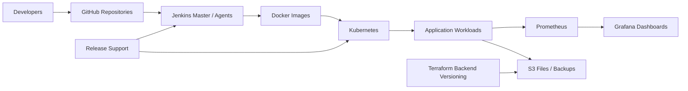

# POC 07: Digital Media Platform - Kubernetes, S3, Jenkins And Monitoring

Prepared for: **Saurabh Dindokar**  
Role: **AWS DevOps Engineer**  
Public-safe name: **Digital Media Platform**

## Confidentiality Note

This POC excludes private repository URLs, environment values, credentials, IP addresses, dashboard links, and client-specific deployment details.

## POC Objective

Create a DevOps support blueprint for application availability, monitoring, S3 backup storage, Terraform backend versioning, Jenkins master-agent performance, GitHub repository maintenance, and Kubernetes-based container orchestration.

## Support And Delivery Diagram



## What I Worked On

- Supported application availability and performance improvement activities.
- Monitored build machines, deployment machines, and application environments using Prometheus and Grafana.
- Created S3 buckets for files and backups.
- Used Terraform backend versioning concepts.
- Supported continuous delivery for releases.
- Implemented Jenkins master-agent structure to improve Jenkins performance.
- Maintained GitHub repositories and supported Kubernetes orchestration for Docker containers.

## POC Implementation Scope

- Jenkins master-agent pipeline pattern.
- Kubernetes deployment and service manifests.
- Prometheus/Grafana monitoring notes.
- S3 backup bucket structure and lifecycle considerations.
- Terraform backend versioning notes.
- GitHub repository maintenance checklist.

## Suggested Repository Structure

```text
digital-media-k8s-monitoring-poc/
|-- README.md
|-- k8s/
|   |-- deployment.yaml
|   `-- service.yaml
|-- jenkins/
|   `-- Jenkinsfile
|-- monitoring/
|   |-- prometheus-notes.md
|   `-- grafana-dashboard-notes.md
|-- terraform-backend/
|   `-- backend-example.hcl
`-- docs/
    |-- repository-maintenance.md
    `-- release-support.md
```

## Validation Steps

1. Validate Kubernetes manifests.
2. Review Jenkins master-agent pipeline stages.
3. Confirm S3 backup/lifecycle plan.
4. Review monitoring dashboard checklist.
5. Confirm repository maintenance and release support runbooks.

## Expected Outcome

- Better release and support readiness.
- Improved Jenkins performance pattern.
- Clear Kubernetes deployment and monitoring documentation.
- Structured S3 backup and Terraform backend planning.

## Technologies

AWS S3, Terraform, Jenkins, GitHub, Kubernetes, Docker, Prometheus, Grafana, CI/CD, release support.

